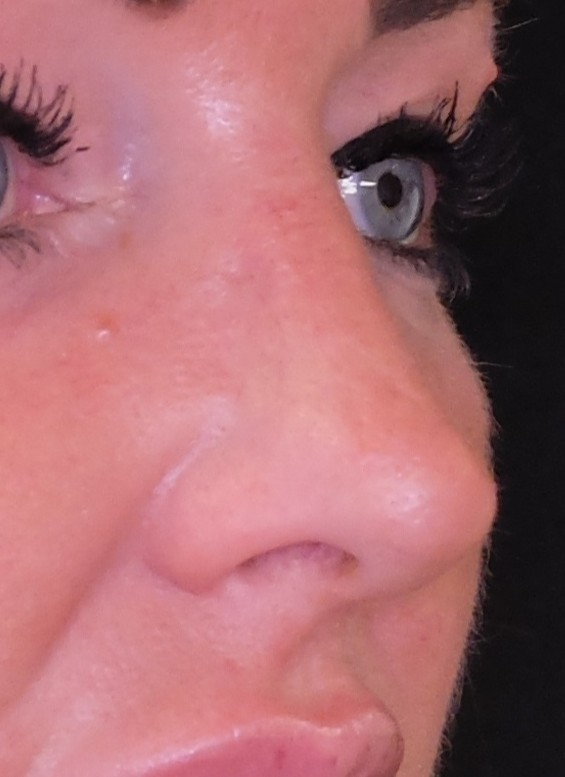
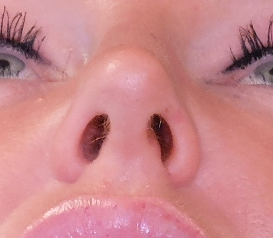
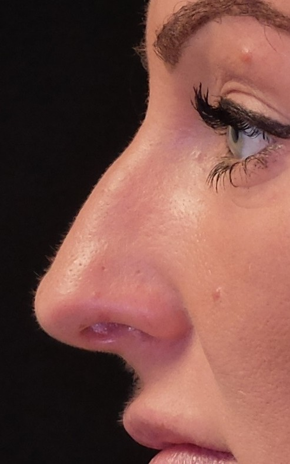
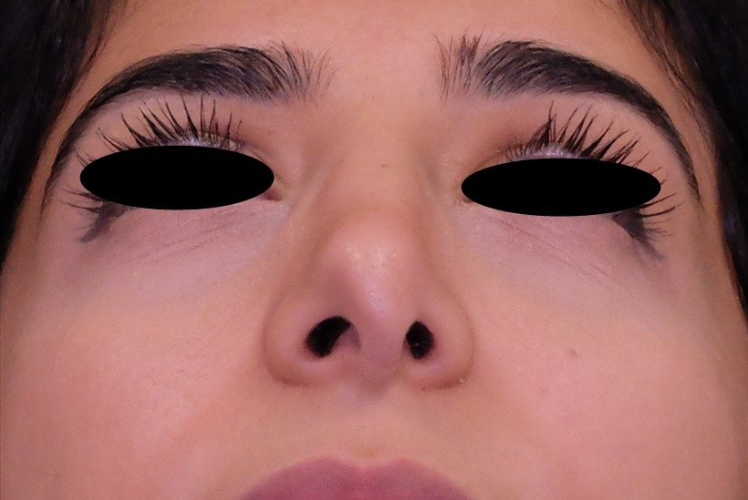

    

        

            <h1 class="homepage-banner-text-heading">SAMA RHINOPLASTY</h1>
            <h2 class="homepage-banner-text-subheading">Prof. Ansul Sama</h2>
            
            
        

        <h1 class="homepage-quote quote-text">
            

                “A smile is happiness you will find right under your nose. Let’s find you a nose that puts a smile on your face”
            

        </h1>
    

    

        

        <h2 class="page-subheading">The Nose you always wanted.</h2>
        

            Noses come in all shapes and sizes. In Rhinoplasty surgery, there is no “one size fits all”. It must be a “made to measure” procedure that successfully addresses your concerns, improves breathing and is in harmony with your facial features.
              
            Rhinoplasty Can Help To:
            <ul>
                <li>Reduce a nasal hump</li>
                <li>Correct a drooping or hooked nose</li>
                <li>Change the size of your nose</li>
                <li>Improve the shape, size and angle of the nasal tip</li>
                <li>Change the shape and size of the nostrils</li>
                <li>Improve breathing and correct the septum</li>
                <li>Repair injuries to the nose</li>
            </ul>
        

        

        

        

    

    

        

            

                <button class="homepage-comparison-button prev">
                    
                </button>
                

                    

                        

                        

                    

                    

                        

                        

                    

                    

                        

                        

                    

                    

                        

                        

                    

                    

                        

                        

                    

                

                <button class="homepage-comparison-button next">
                    
                </button>
            

        

    

    

    

        

            

            

            

            

            

            

            

            

            

            

            

            

        

    

    

